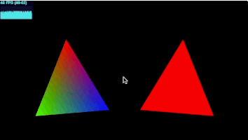

## Aula 2 - 28/02/2014

### Tarefa #2
 - Faça com que o exemplo rotationSquare1.js desenhe dois triângulos, um ao lado do outro, em cores diferentes, e que um rotacione no sentido anti-horário e outro no sentido horário.
 - Faça com que ele rode tanto em WebGL quanto como uma aplicação desktop.

### Resolução WebGL

O código foi feito com a base para WebGL [com webgl-boilerplate - ainda não finalizado](https://github.com/andersonfreitas/webgl-boilerplate).

### Resolução OpenGL

 - TO DO
