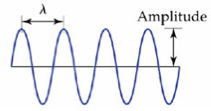

# Tarefa 4
## Bandeira em WebGL

Link [http://andersonfreitas.com/MAC5744/tarefa4/](http://andersonfreitas.com/MAC5744/tarefa4/)

Faça um programa em WebGL para simular a movimentação de uma bandeira ao vento:

  - Desenhe a bandeira (uma superfície planar em x-z) através de uma série de triângulos adjacentes
  - Use a equação abaixo para a sua movimentação (em funcão de z):

  =A\sin&space;\left(&space;{&space;\frac&space;{2\pi}{\lambda}&space;}&space;\left(&space;x-vt&space;\right)&space;\right))

  

  - Use o vertex shader para transladar os vértices dos triângulos componentes da superfície no eixo y.
  - Qual o vetor normal correspondente à função acima?

## To do list

  - Criar uma função que desenhe um retângulo NxM com uma resolução X de quads (ou um fator de subdivisão)

  - Mapear uma textura (bandeira do Brasil)

  - Movimentar cada um dos vertices usando a equação dada

  - Usar dat.gui para controlar parâmetros
    - Resolução de Quads
    - Direção do vento
    - Força do vento

  - Acrescentar uma forma de simular gravidade (com um *shear* no eixo Y)

