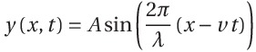

# Tarefa 4
## Bandeira em WebGL

Faça um programa em WebGL para simular a movimentação de uma bandeira ao vento:

  - Desenhe a bandeira (uma superfície planar em x-z) através de uma série de triângulos adjacentes
  - Use a equação abaixo para a sua movimentação:

  
  

  - Use o vertex shader para transladar os vértices dos triângulos componentes da superfície no eixo y.
  - Qual o vetor normal correspondente à função acima?
